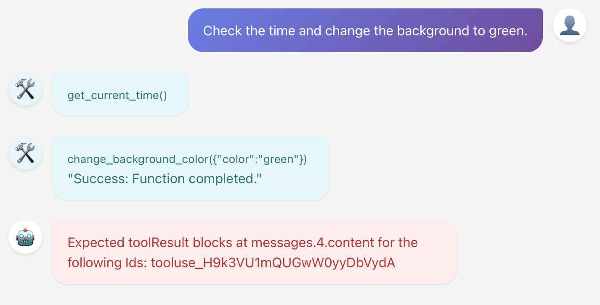

# AgenticTodos

This experimental application aims to explore the following technologies:

- Microsoft Agent Framework
- AG-UI
- WebMCP

## Problems

### ✅ AmazonBedrockRuntimeClient does not support AdditionalProperties

Amazon Bedrock Runtime client throws this exception, when used with AG-UI:

```log
Amazon.BedrockRuntime.Model.ValidationException: The model returned the following errors: ag_ui_thread_id: Extra inputs are not permitted
---> Amazon.Runtime.Internal.HttpErrorResponseException: Exception of type 'Amazon.Runtime.Internal.HttpErrorResponseException' was thrown.
at Amazon.Runtime.HttpWebRequestMessage.ProcessHttpResponseMessage(HttpResponseMessage responseMessage)
```

This is reproduced by [AgenticTodos.Tests.AmazonBedrockTest.WithAdditionalModelRequestFields()](./tests/AmazonBedrockTest.cs):

```csharp
var response = await client.GetResponseAsync(
    messages:
    [
        new ChatMessage(ChatRole.User, "Hello. How are you?"),
    ],
    options: new()
    {
        Temperature = 0.0F,
        Tools = [],
        AdditionalProperties = new()
        {
            { "ag_ui_thread_id", "thread_ba818347681144109377b1c044e4f4f6" },
        },
    });
```

We can circumvent that by removing these `AdditionalProperties` from the chat options via [OmitAdditionalPropertiesMiddleware.cs](backend/OmitAdditionalPropertiesMiddleware.cs). Problem solved.

### ✅ AG-UI Client does not support Angular

AG-UI is very well supported by Copilot Kit, but that requires next.js. There is currently no functional Angular support.

We can probably circumvent that by using `@ag-ui/client @ag-ui/core` (⚠️ 4 high severity vulnerabilities) and glue it together.

See [AgentSubscriber](https://docs.ag-ui.com/sdk/js/client/subscriber).

We can implement the event handlers directly and map them back to the angular frontend in [chat.component.ts](frontend/src/app/chat.component.ts).

### ❌ AG-UI Client does not support Amazon Bedrock's parallel tool calls

We have one backend and one frontend tool. Amazon Bedrock returns them as parallel tool calls, which AG-UI returns to the client, before it ends the run:

```text/event-stream
data: {"threadId":"84fdb1c8-9c1b-496a-9e7e-cd2648983b28","runId":"d2baec31-9059-4348-9947-2de9721b2cea","type":"RUN_STARTED"}

data: {"toolCallId":"tooluse_H9k3VU1mQUGwW0yyDbVydA","toolCallName":"get_current_time","parentMessageId":"ff5c53235e0146c1ada1ae3a2965a96c","type":"TOOL_CALL_START"}

data: {"toolCallId":"tooluse_H9k3VU1mQUGwW0yyDbVydA","delta":"null","type":"TOOL_CALL_ARGS"}

data: {"toolCallId":"tooluse_H9k3VU1mQUGwW0yyDbVydA","type":"TOOL_CALL_END"}

data: {"toolCallId":"tooluse_a1WlhjrIQbqVAKrb1oQo0Q","toolCallName":"change_background_color","parentMessageId":"ff5c53235e0146c1ada1ae3a2965a96c","type":"TOOL_CALL_START"}

data: {"toolCallId":"tooluse_a1WlhjrIQbqVAKrb1oQo0Q","delta":"{\u0022color\u0022:\u0022green\u0022}","type":"TOOL_CALL_ARGS"}

data: {"toolCallId":"tooluse_a1WlhjrIQbqVAKrb1oQo0Q","type":"TOOL_CALL_END"}

data: {"threadId":"84fdb1c8-9c1b-496a-9e7e-cd2648983b28","runId":"d2baec31-9059-4348-9947-2de9721b2cea","result":null,"type":"RUN_FINISHED"}
```

Since the frontend end can only handle one tool, it only creates a single tool result message for one tool call.

```json
[
    { "id": "", "role": "user", "content": "hallo" },
    { "id": "867e82b706c54fbca74d55273be5f656", "role": "assistant", "content": "Hello! How can I help you today?" },
    { "id": "", "role": "user", "content": "Check the time and change the background to green." },
    { "id": "ff5c53235e0146c1ada1ae3a2965a96c", "role": "assistant", 
        "toolCalls": [
            { "id": "tooluse_H9k3VU1mQUGwW0yyDbVydA", "type": "function", "function": { "name": "get_current_time", "arguments": "null" } }, 
            { "id": "tooluse_a1WlhjrIQbqVAKrb1oQo0Q", "type": "function", "function": { "name": "change_background_color", "arguments": "{\"color\":\"green\"}" } }
        ]
    },
    { "id": "tooluse_a1WlhjrIQbqVAKrb1oQo0Q", "role": "tool", "content": "\"Success: Function completed.\"", "toolCallId": "tooluse_a1WlhjrIQbqVAKrb1oQo0Q" }
]
```

This then fails Amazon Bedrock validation, because the second tool result is missing:

```text/event-stream
data: {"threadId":"84fdb1c8-9c1b-496a-9e7e-cd2648983b28","runId":"0869065f-7a16-4a0c-b8cc-f60bce1a3a5d","type":"RUN_STARTED"}

data: {"message":"Expected toolResult blocks at messages.4.content for the following Ids: tooluse_H9k3VU1mQUGwW0yyDbVydA","code":"StreamingError","type":"RUN_ERROR"}
```



OpenAI returns tool calls sequentually, which works fine.

How can we make Amazon Bedrock return tool calls sequentually and not in parallel?
