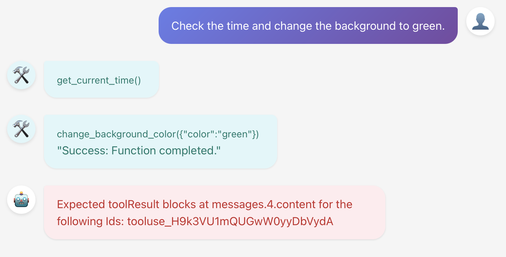

# AgenticTodos

This experimental application aims to explore the following technologies:

- Microsoft Agent Framework
- AG-UI
- WebMCP
- MCP Apps (`@modelcontextprotocol/ext-apps`)

## Development

The system needs OpenAI and/or Amazon Bedrock credentials. Lets focus on AWS:

```bash
aws iam create-user --user-name agents-experiments
aws iam attach-user-policy --user-name agents-experiments --policy-arn arn:aws:iam::aws:policy/AmazonBedrockFullAccess
aws iam create-access-key --user-name agents-experiments
```

These secrets are managed by dotnet:

```bash
cd backend
dotnet user-secrets set AWSBedrockAccessKeyId ...
dotnet user-secrets set AWSBedrockSecretAccessKey ...
```

The `get-time-app` MCP app must be built before the first run (produces `dist/get-time.html` which the MCP server reads at runtime):

```bash
cd mcpserver/get-time-app
npm install
npm run build
```

The Angular sandbox script must also be built once (produces `backend/wwwroot/sandbox.js` needed for the double-iframe MCP app renderer):

```bash
cd frontend
npm run build:sandbox
```

Then run the backend and frontend locally:

```bash
aspire run
```

We can test AG-UI with the backend using the CLI:

```bash
cd cli
dotnet run -- agent "Your prompt here"
```

### State round-trip via CLI

The AG-UI protocol supports round-tripping arbitrary state between client and server via `STATE_SNAPSHOT` events. Use `--state` to seed an initial `ConversationState` (selected resources and metadata). The server injects it as context for the LLM and echoes it back each turn — the CLI captures the snapshot and resends it automatically on subsequent turns.

```bash
dotnet run -- agent "What files do I have selected?" \
  --state '{"conversation":{"selectedResources":["readme.md","notes.txt"],"counter":0}}'
```

The `[State: ...]` line printed after each response shows the current round-tripped state. On the server the state is managed by [`StateSnapshotMiddleware`](backend/StateSnapshotMiddleware.cs).

## Problems

### ✅ AmazonBedrockRuntimeClient does not support AdditionalProperties

Amazon Bedrock Runtime client throws this exception, when used with AG-UI:

```log
Amazon.BedrockRuntime.Model.ValidationException: The model returned the following errors: ag_ui_thread_id: Extra inputs are not permitted
---> Amazon.Runtime.Internal.HttpErrorResponseException: Exception of type 'Amazon.Runtime.Internal.HttpErrorResponseException' was thrown.
at Amazon.Runtime.HttpWebRequestMessage.ProcessHttpResponseMessage(HttpResponseMessage responseMessage)
```

This is reproduced by [AgenticTodos.Tests.AmazonBedrockTest.WithAdditionalModelRequestFields()](./tests/AmazonBedrockTest.cs):

```csharp
var response = await client.GetResponseAsync(
    messages:
    [
        new ChatMessage(ChatRole.User, "Hello. How are you?"),
    ],
    options: new()
    {
        Temperature = 0.0F,
        Tools = [],
        AdditionalProperties = new()
        {
            { "ag_ui_thread_id", "thread_ba818347681144109377b1c044e4f4f6" },
        },
    });
```

We can circumvent that by removing these `AdditionalProperties` from the chat options via [OmitAdditionalPropertiesMiddleware.cs](backend/OmitAdditionalPropertiesMiddleware.cs). Problem solved.

### ✅ AG-UI Client does not support Angular

AG-UI is very well supported by Copilot Kit, but that requires next.js. There is currently no functional Angular support.

We can probably circumvent that by using `@ag-ui/client @ag-ui/core` (⚠️ 4 high severity vulnerabilities) and glue it together.

See [AgentSubscriber](https://docs.ag-ui.com/sdk/js/client/subscriber).

We can implement the event handlers directly and map them back to the angular frontend in [chat.component.ts](frontend/src/app/chat.component.ts).

### ✅ AG-UI endpoint mappings do not support per-request agent selection

The official `.MapAGUI()` methods require an `AIAgent` object to be passed in. That does not work if we want to select an agent at request level. Unfortunately all the AGUI types are internal, so we cannot easily build our own endpoints.

I started a PR to allow for a request-level callback which allows deferred agent selection:

<https://github.com/microsoft/agent-framework/pull/2343>

Now there is even another PR:

<https://github.com/microsoft/agent-framework/pull/3162>

Merge hesitancy comes from perceived inconsistency risks regarding A2A.

Possible workarounds are

- use a [`HttpContextRoutingAgent`](https://github.com/microsoft/agent-framework/pull/3162#issuecomment-3754459882)
- use reflection to instantiate the AGUI types ([example](./backend/AguiReflectionController.cs))

Neither are great solutions, but good enough.

### ✅ Rendering MCP Apps in the frontend

When the agent calls a tool that carries `ui.resourceUri` metadata in its MCP definition, the backend detects this via [`McpAppsActivityMiddleware`](backend/McpAppsActivityMiddleware.cs) and emits an `ACTIVITY_SNAPSHOT` AG-UI event carrying `resourceUri`, `toolInput`, and `toolResult`. The frontend renders the actual MCP app HTML inside a sandboxed double-iframe using the `@modelcontextprotocol/ext-apps` AppBridge protocol.

**Security model — double-iframe with cross-origin sandbox:**

- Host: `http://localhost:3000` (Angular/Vite dev server)
- Outer sandbox iframe: `http://localhost:5288/sandbox.html` (ASP.NET backend — a different origin, giving cross-origin isolation)
- Inner iframe: MCP app HTML injected via the AppBridge `sendSandboxResourceReady` message

The frontend's [`McpClientService`](frontend/src/app/mcp-client.service.ts) creates its own MCP client that connects to the backend's transparent HTTP relay at `/agents/mcp-relay`. The relay forwards all MCP Streamable HTTP traffic to the real MCP server, allowing the AppBridge inside the iframe to call server tools directly.

**Key files:**

| File | Role |
| --- | --- |
| [`frontend/src/app/mcp-app.component.ts`](frontend/src/app/mcp-app.component.ts) | Standalone Angular component that mounts the double-iframe |
| [`frontend/src/app/mcp-client.service.ts`](frontend/src/app/mcp-client.service.ts) | Singleton MCP client connected via the relay |
| [`frontend/src/sandbox.ts`](frontend/src/sandbox.ts) | Outer iframe relay script (compiled to `backend/wwwroot/sandbox.js`) |
| [`backend/McpAppsActivityInjector.cs`](backend/McpAppsActivityInjector.cs) | Translates internal `mcp-activity` SSE markers to `ACTIVITY_SNAPSHOT` events |

### ✅ AGUI routing agent intercepts `/agents/mcp-relay`

`app.MapAGUIViaHttpRoutingAgent()` registers middleware that handles all `/agents/*` paths. If the MCP relay (`app.Map("/agents/mcp-relay", ...)`) is placed after it, the routing agent intercepts requests first and returns 405 for HTTP methods it doesn't support (GET, which the MCP Streamable HTTP transport uses for SSE).

Fixed by registering the relay as an `app.Use()` middleware branch placed **before** `app.MapAGUIViaHttpRoutingAgent()` in [`backend/Program.cs`](backend/Program.cs).

### ❌ AG-UI Client does not support Amazon Bedrock's parallel tool calls

We have one backend and one frontend tool. Amazon Bedrock returns them as parallel tool calls, which AG-UI returns to the client, before it ends the run:

```text/event-stream
data: {"threadId":"84fdb1c8-9c1b-496a-9e7e-cd2648983b28","runId":"d2baec31-9059-4348-9947-2de9721b2cea","type":"RUN_STARTED"}

data: {"toolCallId":"tooluse_H9k3VU1mQUGwW0yyDbVydA","toolCallName":"get_current_time","parentMessageId":"ff5c53235e0146c1ada1ae3a2965a96c","type":"TOOL_CALL_START"}

data: {"toolCallId":"tooluse_H9k3VU1mQUGwW0yyDbVydA","delta":"null","type":"TOOL_CALL_ARGS"}

data: {"toolCallId":"tooluse_H9k3VU1mQUGwW0yyDbVydA","type":"TOOL_CALL_END"}

data: {"toolCallId":"tooluse_a1WlhjrIQbqVAKrb1oQo0Q","toolCallName":"change_background_color","parentMessageId":"ff5c53235e0146c1ada1ae3a2965a96c","type":"TOOL_CALL_START"}

data: {"toolCallId":"tooluse_a1WlhjrIQbqVAKrb1oQo0Q","delta":"{\u0022color\u0022:\u0022green\u0022}","type":"TOOL_CALL_ARGS"}

data: {"toolCallId":"tooluse_a1WlhjrIQbqVAKrb1oQo0Q","type":"TOOL_CALL_END"}

data: {"threadId":"84fdb1c8-9c1b-496a-9e7e-cd2648983b28","runId":"d2baec31-9059-4348-9947-2de9721b2cea","result":null,"type":"RUN_FINISHED"}
```

Since the frontend end can only handle one tool, it only creates a single tool result message for one tool call.

```json
[
    { "id": "", "role": "user", "content": "hallo" },
    { "id": "867e82b706c54fbca74d55273be5f656", "role": "assistant", "content": "Hello! How can I help you today?" },
    { "id": "", "role": "user", "content": "Check the time and change the background to green." },
    { "id": "ff5c53235e0146c1ada1ae3a2965a96c", "role": "assistant", 
        "toolCalls": [
            { "id": "tooluse_H9k3VU1mQUGwW0yyDbVydA", "type": "function", "function": { "name": "get_current_time", "arguments": "null" } }, 
            { "id": "tooluse_a1WlhjrIQbqVAKrb1oQo0Q", "type": "function", "function": { "name": "change_background_color", "arguments": "{\"color\":\"green\"}" } }
        ]
    },
    { "id": "tooluse_a1WlhjrIQbqVAKrb1oQo0Q", "role": "tool", "content": "\"Success: Function completed.\"", "toolCallId": "tooluse_a1WlhjrIQbqVAKrb1oQo0Q" }
]
```

This then fails Amazon Bedrock validation, because the second tool result is missing:

```text/event-stream
data: {"threadId":"84fdb1c8-9c1b-496a-9e7e-cd2648983b28","runId":"0869065f-7a16-4a0c-b8cc-f60bce1a3a5d","type":"RUN_STARTED"}

data: {"message":"Expected toolResult blocks at messages.4.content for the following Ids: tooluse_H9k3VU1mQUGwW0yyDbVydA","code":"StreamingError","type":"RUN_ERROR"}
```



OpenAI returns tool calls sequentually, which works fine.

How can we make Amazon Bedrock return tool calls sequentually and not in parallel?
